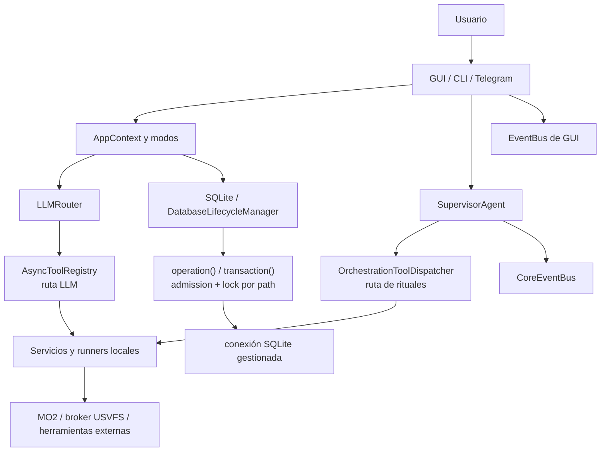

# Arquitectura de Sky-Claw

> **Audiencia:** desarrolladores, operadores y agentes de IA.
> **Estado:** implementado con áreas parciales señaladas en cada documento.
> **Fuentes canónicas:** `sky_claw/__main__.py`, `sky_claw/app_context.py`,
> `sky_claw/app/`, `sky_claw/local/` y ADR aprobados.
> **Última verificación integral:** 2026-07-25 sobre `origin/main` `c6ab35e`.
> **Sincronización DB/lifecycle:** 2026-08-16 sobre `main` `7156718`.
> **Sincronización parcial xEdit LLM:** 2026-09-04 sobre `main` `10354c2b` (#548);
> limitada a la frontera read-only de `run_xedit_script` en la ruta del agente.

Sky-Claw es un plano de control local para operar flujos de modding de Skyrim
SE/AE sobre Mod Organizer 2. Combina interfaces GUI, CLI y Telegram con dos
rutas de herramientas, servicios asíncronos, persistencia SQLite y procesos
externos. El norte del producto es una **caja negra de vuelo con controles
humanos**, no un agente autónomo irrestricto; véase
[ADR 0002](docs/adr/0002-norte-caja-negra.md).

## Mapa de documentación

- [Contexto y límites del sistema](docs/architecture/system_context.md)
- [Ciclo de vida de runtime](docs/architecture/runtime_lifecycle.md)
- [Concurrencia y cancelación](docs/architecture/async_concurrency.md)
- [Rutas de agentes y herramientas](docs/architecture/agent_tool_routing.md)
- [Datos, locks, journal y recuperación](docs/architecture/data_persistence_recovery.md)
- [Fronteras de seguridad](docs/architecture/security_boundaries.md)
- [MO2, USVFS y subprocesos](docs/architecture/mo2_vfs_subprocesses.md)
- [GUI y comunicaciones](docs/architecture/ui_comms.md)
- [ADRs vigentes](docs/adr/README.md)

## Vista de componentes

### Boundary de base de datos

Los consumidores lifecycle-backed no deben interpretar
`get_connection(path)` como permiso para conservar y usar la conexión fuera de
un boundary. El contrato actual separa resolución y uso:

- `operation(path)` mantiene admisión, lock por path y conexión vigente durante
  toda una unidad SQL;
- `transaction(path)` mantiene ese boundary durante la transacción completa y
  coordina commit/rollback;
- `shutdown_all()` cierra la admisión, espera que drene el trabajo ya admitido y
  recién después hace checkpoint/cierre;
- `init_all()` es la reapertura explícita y está serializada contra shutdown.

Por eso, para un consumidor gestionado, volver al patrón
`get_connection() -> await -> SQL` puede reintroducir una carrera con shutdown.
La referencia detallada y el alcance verificado están en
[data_persistence_recovery.md](docs/architecture/data_persistence_recovery.md).

### Dos rutas de herramientas

1. `AsyncToolRegistry`, construido en `AppContext`, valida parámetros Pydantic
   y ejecuta handlers invocados por el loop de herramientas del `LLMRouter`.
2. `OrchestrationToolDispatcher`, construido por
   `build_orchestration_dispatcher()`, registra `ToolStrategy` y middleware
   para rituales del `SupervisorAgent`.

No son alias ni comparten la misma API. El detalle está en
[agent_tool_routing.md](docs/architecture/agent_tool_routing.md).

En la ruta LLM, la capacidad de xEdit expuesta al agente (`run_xedit_script`) es
**read-only** desde #548: sólo ejecuta una allowlist de scripts de diagnóstico
bundleados, con la misma política compartida por el schema y el runtime, staging
canónico obligatorio y fallo cerrado ante nombres desconocidos. Las rutas de xEdit
que **mutan** (rituales vía `XEditPipelineService`) tienen otra frontera; ver
[security_boundaries.md](docs/architecture/security_boundaries.md).

### Resultados de tools

Los servicios emiten diccionarios crudos que incluyen `success: bool` y
`message: str`. `normalize_tool_result()` es la única función que interpreta
claves legacy. En el camino productivo actual la usa
`gui/controllers/ritual_runner.py`; otros consumidores deben utilizarla si
necesitan la vista común `ToolResult`.

### Dos buses de eventos

- `CoreEventBus` es el bus asíncrono del core/orquestador, con backpressure,
  DLQ y lifecycle explícito.
- `gui.gui_event_adapter.EventBus` adapta eventos al loop de NiceGUI.

Compartir el nombre conceptual no los convierte en la misma instancia ni les
da el mismo contrato de arranque y cierre.

## Principios verificables

- El runtime es prioritariamente asíncrono; I/O síncrona heredada se deriva a
  threads donde el código lo implementa. No se afirma que toda I/O del árbol
  sea no bloqueante.
- Las operaciones de archivo y egress deben atravesar las validaciones
  inyectadas en su camino productivo; los límites y excepciones vigentes están
  documentados en [security_boundaries.md](docs/architecture/security_boundaries.md).
- Las mutaciones críticas usan locks, snapshots, journal y, cuando corresponde,
  sandbox de perfil y aprobación HITL.
- Los consumidores SQLite gestionados deben conservar el boundary de lifecycle
  durante el SQL; obtener la conexión por sí solo no congela su validez frente
  a un shutdown concurrente.
- Los tests con subprocess mockeado no prueban MO2/USVFS ni herramientas reales.
  Los smokes pendientes se registran en
  [real_rig_validation.md](docs/operations/real_rig_validation.md).

## Estado documental

`ARCHITECTURE.md` es el portal ejecutivo. Las firmas, campos y estados exactos
pertenecen a [docs/api](docs/api/README.md); las decisiones a
[docs/adr](docs/adr/README.md); los hallazgos históricos a
[docs/audits](docs/audits/README.md).

La marca de sincronización DB/lifecycle no afirma que todo este portal haya sido
reverificado contra `7156718`: sólo actualiza el contrato de persistencia que
cambió después de la verificación integral de julio. Para contradicciones, usar
[la política de fuentes de verdad](docs/documentation/source_of_truth.md).
