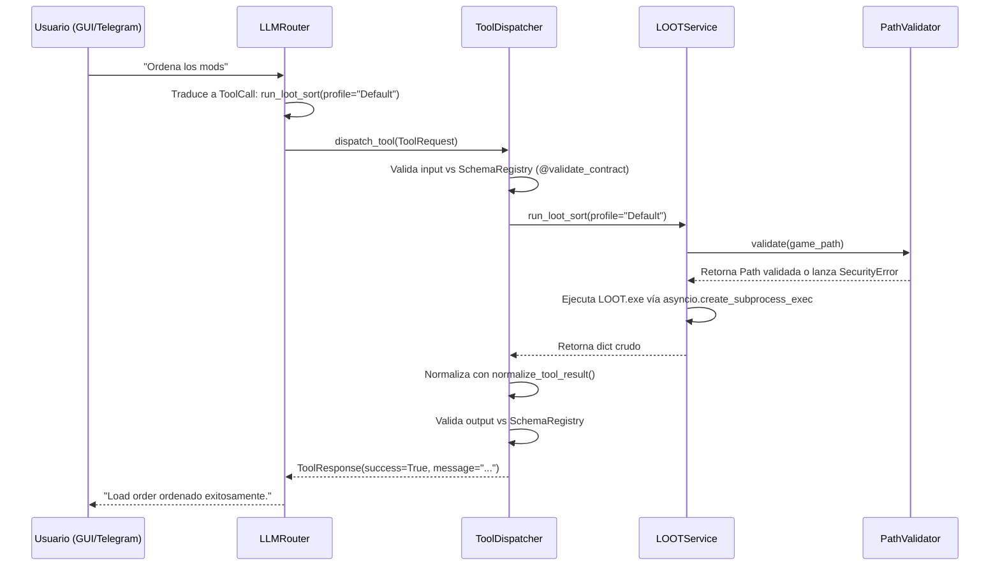

# Sky-Claw Architecture

> **Audiencia:** Desarrolladores humanos y agentes de IA que necesitan comprender la topología del sistema, el flujo de datos y las capas de responsabilidad.
> **Documento hermano:** [CONTRIBUTING.md](CONTRIBUTING.md) para flujo de trabajo y setup.

---

## 1. Visión General del Sistema

Sky-Claw no es un simple script de automatización; es un **ecosistema de orquestación asíncrono** diseñado para gestionar el ciclo de vida completo del modding en Skyrim SE/AE. Actúa como una capa de inteligencia artificial que opera sobre el Virtual File System (VFS) de Mod Organizer 2 (MO2), coordinando herramientas externas (LOOT, xEdit, Synthesis), interactuando con APIs web (Nexus Mods, LLMs) y proveyendo interfaces de usuario (GUI, Telegram, CLI).

El sistema está diseñado bajo una arquitectura dirigida por eventos y agentes, donde múltiples componentes autónomos colaboran bajo un modelo de seguridad "Zero-Trust".

### 1.1 Principios de Diseño Fundamentales

- **Asincronía Estricta:** Toda I/O (disco, red, subprocesos) es no bloqueante. El event loop de `asyncio` es el corazón del sistema.
- **Seguridad Zero-Trust:** Las operaciones de archivo están estrictamente limitadas al sandbox de MO2. Las descargas externas requieren intervención humana (HITL) o listas blancas de dominios.
- **Orientación a Contratos:** Los agentes y herramientas se comunican mediante interfaces estrictamente tipadas y validadas en tiempo de ejecución (Pydantic).
- **Inversión de Dependencias:** Las capas superiores no dependen de implementaciones concretas de las capas inferiores, sino de `Protocol`s definidos en el núcleo.

---

## 2. Topología de Capas

El código fuente en `sky_claw/` se divide conceptualmente en cuatro capas arquitectónicas.

```text
┌─────────────────────────────────────────────────────────────────────────┐
│                          CAPA DE PRESENTACIÓN                           │
│  GUI (NiceGUI)  │  Telegram Gateway (Node.js)  │  CLI (Argumentos)     │
└────────┬────────┴──────────────┬───────────────┴────────┬───────────────┘
         │                       │                        │
         ▼                       ▼                        ▼
┌─────────────────────────────────────────────────────────────────────────┐
│                        CAPA DE ORQUESTACIÓN                             │
│                  (antigravity/orchestrator/)                            │
│  ┌──────────────┐  ┌───────────────┐  ┌────────────────┐               │
│  │ Tool Dispatcher│  │ Sync Engine   │  │ Supervisor     │               │
│  └──────────────┘  └───────────────┘  └────────────────┘               │
└───────────────────────────────┬─────────────────────────────────────────┘
                                │ (Llamadas a Tools / Contratos)
                                ▼
┌─────────────────────────────────────────────────────────────────────────┐
│                         CAPA DE DOMINIO (LOCAL)                         │
│                      (local/tools/, local/mo2/)                         │
│  ┌────────────┐ ┌───────────┐ ┌──────────┐ ┌───────────┐               │
│  │ LOOT Runner│ │ xEdit Svc │ │ Wrye Bash│ │ VFS Mount │               │
│  └────────────┘ └───────────┘ └──────────┘ └───────────┘               │
└───────────────────────────────┬─────────────────────────────────────────┘
                                │ (Lectura/Escritura en Disco VFS)
                                ▼
┌─────────────────────────────────────────────────────────────────────────┐
│                        CAPA DE INFRAESTRUCTURA                          │
│            (antigravity/core/, antigravity/security/)                   │
│  ┌──────────────┐  ┌───────────────┐  ┌────────────────┐               │
│  │ DatabaseAgent│  │ PathValidator │  │ LLM Providers  │               │
│  └──────────────┘  └───────────────┘  └────────────────┘               │
└─────────────────────────────────────────────────────────────────────────┘
```

### 2.1 Capa de Presentación
Responsable de la interacción con el usuario. Traduce las intenciones humanas (o de bots) en comandos para el orquestador.
- **`antigravity/gui/`:** Interfaz gráfica Web/Desktop construida con **NiceGUI**. Mantiene su propio event loop que debe sincronizarse con el loop principal de `asyncio`.
- **`antigravity/comms/`:** Provee interfaces conversacionales. Incluye el gateway de Telegram (un proceso Node.js separado que se comunica con el core Python) y clientes web.
- **`__main__.py`:** El punto de entrada CLI que parsea argumentos e inicializa el `AppContext`.

### 2.2 Capa de Orquestación
El cerebro operativo. Maneja el estado global, el ciclo de vida de las tareas y el despacho de herramientas.
- **`antigravity/orchestrator/supervisor.py`:** El agente supervisor que delega tareas.
- **`antigravity/orchestrator/tool_dispatcher.py`:** Registra y expone las herramientas locales como funciones ejecutables por el LLM.
- **`antigravity/orchestrator/sync_engine.py`:** Gestiona la cola de descargas y operaciones de I/O de larga duración.
- **`antigravity/agent/`:** Contiene la lógica de los agentes LLM y el enrutamiento de mensajes.

### 2.3 Capa de Dominio (Local)
Implementa la lógica específica del modding de Skyrim. Cada herramienta externa (LOOT, xEdit, etc.) tiene un "Runner" o "Service" aquí.
- **`local/tools/`:** Wrappers asíncronos para ejecutables externos. Todos emiten un resultado normalizado bajo el contrato `ToolResult` (ver `local/tools/tool_result.py`).
- **`local/mo2/`:** Lógica para interactuar con perfiles, `modlist.txt` y el entorno de Mod Organizer 2.
- **`local/fomod/`:** Parser y resolvedor de instaladores FOMOD.

### 2.4 Capa de Infraestructura
Servicios transversales y de bajo nivel que soportan al resto del sistema.
- **`antigravity/core/`:** El núcleo del sistema.
  - `contracts.py`: Registro de esquemas Pydantic y decoradores de validación (`@validate_contract`).
  - `database.py`: `DatabaseAgent`, encargado de todas las operaciones SQLite (WAL, transacciones batch).
  - `errors.py`: Jerarquía de excepciones tipadas `AppNexusError`.
- **`antigravity/security/`:** Implementación del modelo Zero-Trust.
  - `path_validator.py`: Valida que ninguna ruta escape del sandbox autorizado (protección contra TOCTOU y symlink attacks).
- **`config.py`:** Definición de `SystemPaths` y carga de configuración global desde TOML.

---

## 3. Flujo de Datos Asíncrono

La comunicación entre componentes sigue un patrón de despacho de eventos y llamadas RPC internas validadas por contratos.

### 3.1 Ciclo de Vida de una Petición (Ej. "Ordenar Load Order")



### 3.2 Concurrencia y el Event Loop

Sky-Claw corre sobre un único event loop de `asyncio` (por proceso).
- **I/O Bound:** Llamadas a red (LLM, Nexus) y disco usan `await`.
- **CPU Bound / Bloqueante:** Ejecución de herramientas externas (LOOT, xEdit) usa `asyncio.create_subprocess_exec`. Operaciones de la GUI NiceGUI deben evitar bloquear este loop; se recomienda `asyncio.to_thread` para I/O síncrona heredada.
- **EventBus:** La GUI utiliza un bus de eventos interno que **debe** inicializarse en el `app.on_startup` para garantizar que el loop esté corriendo, de lo contrario los eventos se descartan silenciosamente (ver bug histórico #201).

---

## 4. Modelo de Seguridad

El diseño de seguridad es "Zero-Trust" por defecto, asumiendo que las herramientas externas o los outputs del LLM pueden ser comprometidos.

1.  **Sandboxing de Rutas (LAY-03):** Ninguna herramienta puede leer/escribir fuera de las rutas autorizadas por `SystemPaths`. El `PathValidator` resuelve symlinks y rechaza escapes de directorio (TOCTOU).
2.  **Validación de Contratos (LAY-01):** Todo input y output de agente está tipado. Se prohíbe el parseo libre con regex; se exige Pydantic. Si un LLM alucina un JSON malformado, el `SchemaRegistry` lo rechaza antes de que alcance la lógica de dominio.
3.  **Guardia de Red:** Un `NetworkGateway` restringe el egress a dominios en lista blanca (`*.nexusmods.com`, `api.telegram.org`, proveedores LLM).
4.  **HITL (Human-in-the-Loop):** Descargas de orígenes no confiables (GitHub, Patreon) pausan la ejecución y requieren aprobación explícita vía botones de Telegram. La capa del agente central es, sin embargo, "lock-only" y no interrumpe el flujo sin intervención configuada.

---

## 5. Contratos de Interfaces

La comunicación entre la capa de Orquestación y la de Dominio está mediada por el contrato `ToolResult`. Históricamente, las herramientas retornaban diccionarios con claves inconsistentes (`error`, `stderr`, `logs`).

Desde la resolución de la deuda técnica (#214, #216), **todas** las herramientas deben emitir:

```python
class ToolResult(TypedDict):
    success: bool
    message: str
    return_code: int | None
    warnings: list[str]
```

Cualquier consumidor debe utilizar `normalize_tool_result(raw_dict)` para obtener esta vista normalizada, aislando al sistema de las claves legacy.

---

## 6. Mapas de Código Clave

Para navegar el código, los siguientes archivos son los mejores puntos de partida:

| Concepto | Archivo Principal |
| :--- | :--- |
| Punto de Entrada | `sky_claw/__main__.py` |
| Inicialización App | `sky_claw/app_context.py` |
| Contratos y Validación | `sky_claw/antigravity/core/contracts.py` |
| Pipeline de Modding (Reglas) | `sky_claw/local/AGENTS.md` |
| Normalización de Tools | `sky_claw/local/tools/tool_result.py` |
| Seguridad de Rutas | `sky_claw/antigravity/security/path_validator.py` |
| Despachador de Tools | `sky_claw/antigravity/orchestrator/tool_dispatcher.py` |
