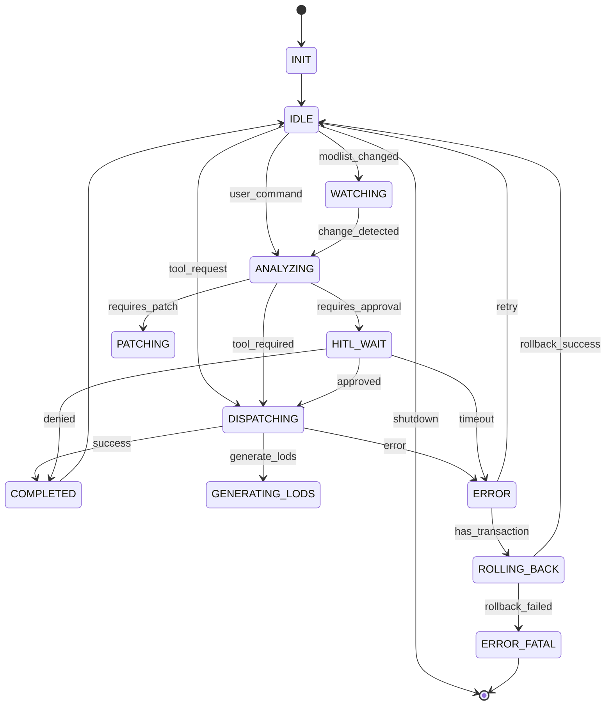

# ADR 0006 — Retiro del SupervisorStateGraph; el cortacircuitos cognitivo vive en el dispatcher

**Fecha:** 2026-07-19
**Estado:** Aceptada
**Contexto de origen:** Hallazgo F1 de la auditoría de resiliencia del
orquestador (`docs/audits/2026-07-18_orchestrator_resilience_audit.md`, PR #319).

## Contexto

`SupervisorStateGraph` (`sky_claw/antigravity/orchestrator/state_graph.py`)
implementaba, sobre LangGraph, un grafo de estados aspiracional para orquestar
al `SupervisorAgent`: nodos `INIT/IDLE/ANALYZING/DISPATCHING/HITL_WAIT/...`,
aristas condicionales, checkpointing, un `StateGraphValidator` de transiciones
y una `StateGraphIntegration` que registraba callbacks para invocar el
`AgenticLoopGuardrail` (cortacircuitos cognitivo) y el flujo HITL.

La auditoría verificó, trazando callers reales, que **nada en producción lo
ejecutaba**:

- Cero llamadas a `SupervisorStateGraph.execute()`, `submit_event()` o
  `LangGraphEventStreamer.stream_execute()` fuera de los propios módulos del
  grafo. La GUI despacha tools por `gui/controllers/ritual_runner.py →
  supervisor.dispatch_tool()`, directo al `OrchestrationToolDispatcher`.
- El streamer se construía en `supervisor.py` y moría ahí.
- `langgraph`, `langgraph-checkpoint`, `langgraph-sdk`, `langchain-core` y
  `langsmith` **no se importaban en ningún otro archivo** del proyecto — cinco
  dependencias (con historial de CVEs que ya obligó a floors manuales en
  `pyproject.toml`) existían solo para el módulo muerto.

Y si el grafo llegara a ejecutarse, fallaría estructuralmente (detalle en la
auditoría, F1): los callbacks escriben el estado mutando el dict de entrada
—que LangGraph descarta, solo persiste lo que el nodo retorna—; los self-loops
de `IDLE`/`HITL_WAIT` iterarían supersteps hasta `GraphRecursionError`; y
`submit_event(thread_id=...)` reinyecta `get_initial_state()` completo,
reseteando `error_count` y volviendo ilusoria la continuación por checkpoint.

## Decisión

**Retirar el StateGraph por completo** y mover su única pieza con valor —el
`AgenticLoopGuardrail`— al **único camino real de ejecución de tools**: el
`OrchestrationToolDispatcher`, como middleware global (`LoopGuardrailMiddleware`,
F1a / PR #328).

Se descartó la alternativa de "cablear el grafo de verdad" porque exigía
arreglar tres bugs estructurales **y** migrar el gate HITL funcional y testeado
(`HitlGateMiddleware`, fail-closed) a `interrupt()`/`Command` de LangGraph —
riesgo de regresión en el camino de seguridad, para reimplementar orquestación
que dispatcher + services + `DistributedLockManager` + journal ya resuelven
transaccionalmente. El patrón del repo ya es "middleware del dispatcher"
(HitlGate, ErrorWrapping, DictResultGuard, Idempotency): el guardrail encaja
ahí sin inventar arquitectura nueva.

## Consecuencias

- Se elimina `state_graph.py` y `LangGraphEventStreamer`
  (`ws_event_streamer.py`); `ToolEventStreamer` se conserva.
- `SupervisorAgent` deja de construir `state_graph`, `event_streamer` y
  `_graph_integration`. El cortacircuitos ahora protege TODAS las tools
  (también las read-only) vía el dispatcher, y se rearma ante intervención
  humana (`reset_loop_guardrail`, invocado por `run_ritual`).
- Se quitan las 5 dependencias LangGraph/LangChain de `pyproject.toml`
  (superficie de CVE y peso de instalación menores).
- Se retiran los tests que ejercían exclusivamente internals del grafo
  (`test_state_graph*.py`, `test_graph_integration_wiring.py`,
  `test_task007_c2_m7.py`, `test_hitl_timeout.py` —que probaba
  `route_from_hitl_wait`, una arista del grafo, NO el timeout real de
  `HITLGuard`—, `test_memory_leak_fix.py`). La cobertura del cortacircuitos
  pasa a `test_loop_guardrail_middleware.py`.

## Registro histórico — diagrama del workflow aspiracional

Se preserva el mapa de estados que documentaba el diseño, como referencia:

