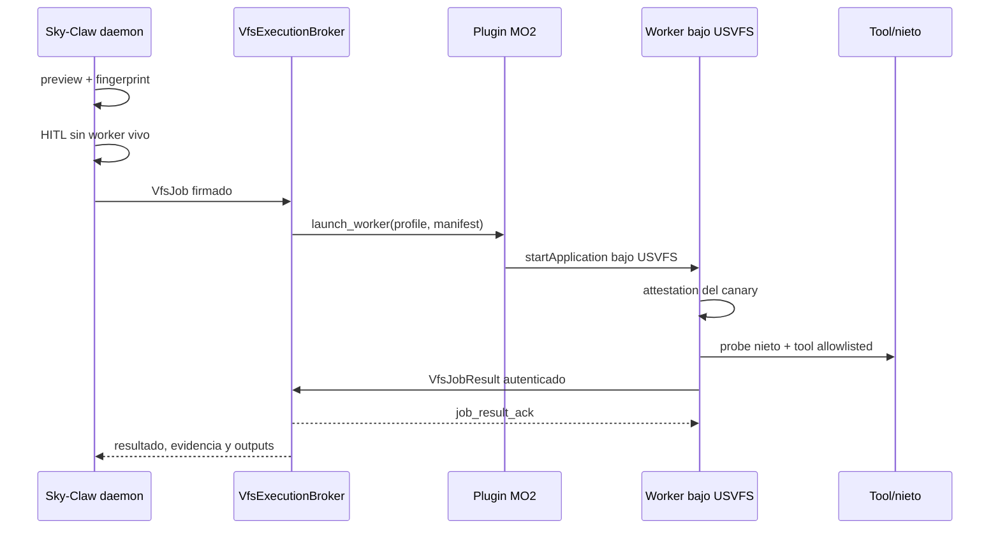

# ADR 0007 - Sky-Claw como control plane y MO2 como broker USVFS

**Fecha:** 2026-07-21
**Estado:** Aceptada
**Contexto de origen:** hallazgo F8 de la auditoria externa `Plan claude.txt`.
Este F8 no es el F8 de la auditoria de resiliencia #319 documentada en
`pending_ooda_status.md`.

## Contexto

Los runners externos ejecutados por el daemon standalone no heredan la vista
virtual del perfil de MO2. Un proceso puede terminar con exit code 0 mientras
LOOT, xEdit u otra herramienta solo vio el `Data` fisico. El resultado es un
falso verde con outputs incompletos.

Lanzar `ModOrganizer.exe` no resuelve por si solo el lifecycle: Sky-Claw
necesita conocer el perfil efectivo, la identidad del worker, el resultado, la
cancelacion y los targets fisicos que cubre el rollback. `moshortcut://` no
ofrece ese contrato de forma confiable.

## Decision

Sky-Claw conserva scheduling, HITL, locks y journal. Un plugin Python minimo
cargado por MO2 solo acepta `health`, `launch_worker` y `cancel`; usa
`IOrganizer.startApplication` con perfil explicito para lanzar un worker fijo
de Sky-Claw bajo USVFS. El worker ejecuta una unica operacion allowlisted y
termina.

### Contrato y seguridad

- IPC loopback con frames length-prefixed y HMAC-SHA256; protocolo versionado.
- Descriptor de sesion y manifests con permisos owner-only, expiracion y firma.
- Identidad de instancia derivada de la ruta MO2 sin exponerla en el ID.
- Cero executables arbitrarios desde IPC. El executable y prefijo del worker
  quedan fijados por `bridge_config.json`; el payload solo usa tool IDs.
- Un owner de broker y un job mutante por instancia MO2. El lock de instancia
  es interproceso y reclama PIDs caidos. Perfil, fingerprint y canary se
  revalidan dentro del worker antes de ejecutar.
- Worker y descendientes quedan contenidos en un Win32 Job Object
  `KILL_ON_JOB_CLOSE`. Cancelacion y timeout se envian al plugin y al worker;
  el broker no libera el job ni habilita rollback hasta recibir `worker_exit`
  del monitor de MO2. El worker no termina voluntariamente despues de reportar
  hasta recibir un `job_result_ack`; por eso `worker_exit` sin resultado
  aceptado es un fallo causal, no una carrera resuelta con una espera temporal.
- El cierre del broker se serializa: llamadas concurrentes comparten el mismo
  teardown y no compiten por sockets, descriptor o lock de instancia.
- Si falta bridge, canary, perfil, version compatible o attestation, la
  ejecucion falla cerrada antes de mutar.
- El broker valida que perfil, fingerprint, canary, prueba del nieto y outputs
  del resultado correspondan al `VfsJob` aprobado.

### HITL y rollback

El preview solo calcula la attestation; no mantiene un worker vivo durante la
espera humana. Despues de la aprobacion, el servicio toma el lock y snapshot de
los targets fisicos, crea un worker nuevo y exige el mismo fingerprint. El
rollback sigue bajo `SnapshotTransactionLock` en el daemon, que es quien posee
los snapshots y el journal.

El quinto argumento de `startApplication` es un **nombre de mod de overwrite
forzado**, no una ruta. LOOT usa el overwrite normal de MO2 (string vacio) y
declara como targets los archivos fisicos del perfil. Una tool futura que
necesite salida dedicada debera enviar el nombre validado de un mod administrado,
nunca `<MO2>/overwrite` como path.

## Alcance implementado

- Infraestructura completa del broker, worker, plugin, instalador y empaquetado.
- Operaciones worker `health` y `loot_sort`.
- Modos de operador `install-vfs-bridge` y `vfs-health` sin arrancar el daemon
  completo.
- LOOT es el primer ritual productivo migrado en sus dos entry points: agente
  lock-only y Supervisor GUI con preview pre-HITL.
- El guard evita que esos paths reconstruyan un `LOOTRunner` standalone.

xEdit, Wrye Bash, Synthesis, DynDOLOD y los demas runners externos aun deben
migrarse al mismo broker antes de declarar cerrado el F8 transversal. No se
considera correcto ocultar esa deuda detras de que LOOT ya este protegido.

## Consecuencias

- Se distribuye y versiona un plugin MO2 adicional.
- Mover o reemplazar el executable de Sky-Claw exige reinstalar el bridge para
  actualizar el worker fijo.
- La compatibilidad debe revalidarse por version de MO2/USVFS; CI solo valida
  contratos y lifecycle con fakes y sockets locales.
- `moshortcut://` no forma parte del backend de produccion.

## Verificacion runtime

El 2026-07-22 se ejecuto `vfs-health` contra MO2 2.5.2 (`9c130cbf`) y USVFS
0.5.6.1, perfil `Default`, en Windows. Paso con exit code 0 tanto con el broker
arrancado antes de MO2 como con MO2 ya abierto. Worker y nieto leyeron el mismo
canary de `Realistic Water Two SE`, ausente del `Data` fisico, y no quedaron
procesos al cerrar.

El primer smoke detecto y este PR corrigio tres defectos que los fakes no
reproducian: `QTimer` creado desde el thread de carga del plugin, logging Unicode
que mataba el thread de reconexion del Python embebido y
`waitForApplication` invocado desde un `threading.Thread`. El bridge ahora usa
una senal Qt encolada, mensajes ASCII-safe y espera Win32 directa con cierre del
HANDLE propiedad del plugin.
