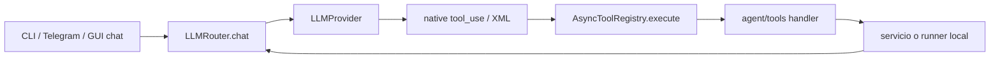

# Enrutamiento de agentes y tools

> **Estado:** implementado en dos rutas distintas.
>
> **Audiencia:** desarrolladores y agentes.
>
> **Fuentes canónicas:** `sky_claw/app/agent/tools/`,
> `sky_claw/app/orchestrator/tool_dispatcher.py`,
> `sky_claw/app/orchestrator/dispatcher_dependencies.py`,
> `sky_claw/app/orchestrator/orchestration_composition.py` y sus callers.
>
> **Última verificación integral previa:** 2026-07-25 sobre `origin/main`
> `c6ab35e`.
>
> **Frontera del dispatcher:** re-verificada el 2026-08-29 contra el código y
> los tests estructurales de este cambio (PR2 de la composición).

## Ruta LLM

`AsyncToolRegistry` anuncia schemas, aplica el `params_model`, allowlist por
sesión y timeout del round. No tiene un middleware HITL general: la política
base es lock-only, aunque handlers concretos como `download_mod` reciben un
`HITLGuard` explícito.

## Ruta de rituales

```mermaid
flowchart LR
    UI["Acción GUI / supervisor"] --> Supervisor["SupervisorAgent.dispatch_tool"]
    Supervisor --> Comp["OrchestrationComposition<br>(build_orchestration_composition)"]
    Comp --> Deps["OrchestrationDispatcherDependencies"]
    Deps --> Dispatcher["OrchestrationToolDispatcher.dispatch"]
    Dispatcher --> MW["Middleware global y por tool"]
    MW --> Strategy["ToolStrategy.execute"]
    Strategy --> Service["servicio local"]
```

El dispatcher registra strategies con `register()`. Puede aplicar loop
guardrail, idempotencia, wrapping de errores, validación de dict y HITL.
Synthesis usa además `SandboxPromotionFlow`.

La frontera de composición es explícita: desde **PR2**, `build_orchestration_composition()`
(`sky_claw/app/orchestrator/orchestration_composition.py`) construye un
`OrchestrationComposition` inmutable (frozen, slots) con las 11 dependencias
finales: 7 servicios de pipeline, dependencias del dispatcher, dispatcher, loop
guardrail y máquina de estados. `SupervisorAgent.__init__` invoca el builder y
conserva las referencias que necesita para lifecycle, APIs existentes y reset
manual del loop guardrail. Desde **PR3** el seam de Grass vive en un provider
con dependencias explícitas y resolución lazy
(`sky_claw/app/orchestrator/grass_runtime_deps.py`); desde **PR4** el seam de
asset conflict scan vive en `AssetConflictScanner`
(`sky_claw/app/orchestrator/asset_conflict_scan.py`), que recibe el resolver de
rutas y el validator de modding y expone `scan` / `scan_json` como callables
estrechos. Desde **PR5** el gate M-04 (plugin-limit) vive en
`PluginLimitGuard` (`sky_claw/app/orchestrator/plugin_limit_guard.py`), que
recibe el `PathResolutionService` y expone su `run` como callable estrecho al
builder — el supervisor ya no entrega bound methods de dominio. El parser
puro de ``plugins.txt``/``loadorder.txt`` (``parse_active_plugins``) vive en
`sky_claw/app/orchestrator/active_plugins.py`; las políticas de precedencia
(``plugins.txt`` antes que ``loadorder.txt``, con la regla histórica de no
caer a fallback cuando ``plugins.txt`` existe pero produce lista vacía)
viven en el `PluginLimitGuard` y NO se unifican con las de
`scan_record_conflicts`, que tiene precedencia distinta. No se anticipa PR6.

`tool_dispatcher.py` no conoce ni consulta al supervisor. Los providers de
preview y Synthesis son lazy y cierran solamente sobre sus servicios, paths,
journal, buses, locks, perfil y guard concretos; construir la composition no
resuelve ejecutables ni rutas de MO2. El callable de Wrye Bash cierra sobre su
servicio y el perfil de sesión, sin capturar al supervisor completo.

La aprobación destructiva pre-ejecución permanece en exactamente siete tools:
LOOT, resolución xEdit, DynDOLOD, Pandora, QuickAutoClean, Grass Cache y Wrye
Bash. Synthesis no usa ese middleware porque su sandbox solicita aprobación
post-ejecución sobre el diff; agregar el gate previo sería double-gating.

## Contratos que no deben mezclarse

- `ToolDescriptor` no es `ToolStrategy`.
- `AsyncToolRegistry.execute()` no es
  `OrchestrationToolDispatcher.dispatch()`.
- El orden de registro no define el DAG de modding.
- `CONTRACT_SCHEMAS` no reemplaza los `params_model` ni los modelos de strategy.
- `normalize_tool_result()` normaliza resultados crudos en consumidores que
  necesitan la vista común; no convierte ambos dispatchers en uno.

Véanse [tools_ref.md](../api/tools_ref.md) y
[tool_creation.md](../agents/tool_creation.md).
