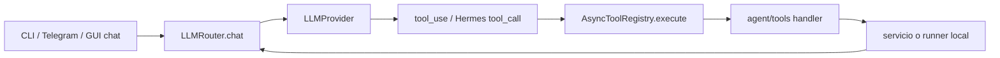
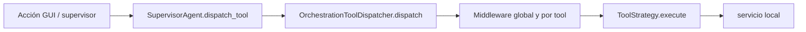

# Enrutamiento de agentes y tools

> **Estado:** implementado en dos rutas distintas.
>
> **Audiencia:** desarrolladores y agentes.
>
> **Fuentes canónicas:** `sky_claw/app/agent/tools/`,
> `sky_claw/app/orchestrator/tool_dispatcher.py` y sus callers.
>
> **Última verificación:** 2026-07-25 sobre `origin/main` `c6ab35e`.

## Ruta LLM

`AsyncToolRegistry` anuncia schemas, aplica el `params_model`, allowlist por
sesión y timeout del round. No tiene un middleware HITL general: la política
base es lock-only, aunque handlers concretos como `download_mod` reciben un
`HITLGuard` explícito.

## Ruta de rituales

El dispatcher registra strategies con `register()`. Puede aplicar loop
guardrail, idempotencia, wrapping de errores, validación de dict y HITL.
Synthesis usa además `SandboxPromotionFlow`.

## Contratos que no deben mezclarse

- `ToolDescriptor` no es `ToolStrategy`.
- `AsyncToolRegistry.execute()` no es
  `OrchestrationToolDispatcher.dispatch()`.
- El orden de registro no define el DAG de modding.
- `CONTRACT_SCHEMAS` no reemplaza los `params_model` ni los modelos de strategy.
- `normalize_tool_result()` normaliza resultados crudos en consumidores que
  necesitan la vista común; no convierte ambos dispatchers en uno.

Véanse [tools_ref.md](../api/tools_ref.md) y
[tool_creation.md](../agents/tool_creation.md).
