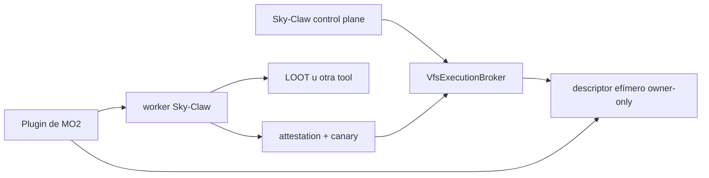

# MO2, USVFS y subprocesos

> **Estado:** broker implementado; validación real dependiente de la instalación.
>
> **Audiencia:** desarrolladores y operadores.
>
> **Fuentes canónicas:** `sky_claw/local/mo2/`, `sky_claw/local/tools/` y ADR 0007.
>
> **Última verificación:** 2026-07-25 sobre `origin/main` `c6ab35e`.

## Flujo

El plugin se instala bajo `<MO2>/plugins/skyclaw_bridge`. El descriptor y token
de sesión viven fuera del plugin. La ejecución fija un perfil explícito y
falla cerrada ante handshake, perfil o canary inválidos.

## Procesos

Los runners deben:

- construir argumentos sin `shell=True`;
- capturar stdout, stderr y return code;
- imponer timeout;
- matar el árbol en Windows cuando haya nietos;
- recolectar el proceso;
- verificar el artefacto esperado.

La implementación común está en `local/tools/_process.py`, pero algunos
runners mantienen lifecycle específico. Revisar el runner real antes de
atribuirle todas las garantías.

## Overwrite

El sandbox clona `<MO2>/overwrite` como área compartida. En el contrato del
broker, el overwrite administrado se identifica mediante un nombre de mod
validado cuando corresponde; no se debe sustituir por una ruta arbitraria.

## Validación

Pytest y PyInstaller no prueban la visión USVFS de una instalación real.
Seguir [real_rig_validation.md](../operations/real_rig_validation.md).
