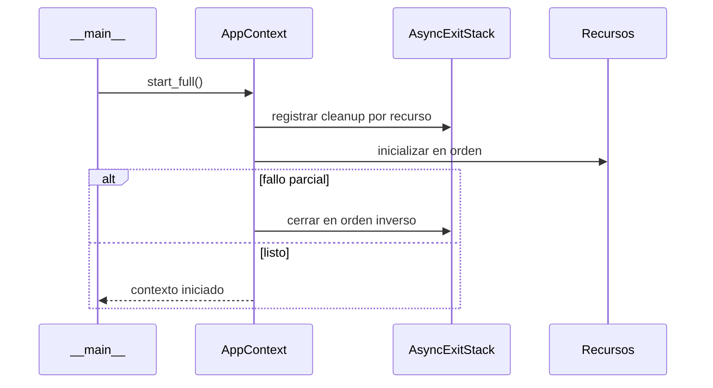

# Ciclo de vida de runtime

> **Estado:** implementado.
>
> **Audiencia:** desarrolladores y operadores.
>
> **Fuentes:** `sky_claw/__main__.py` y `sky_claw/app_context.py`.
>
> **Última verificación integral:** 2026-07-26 sobre una rama basada en
> `origin/main` `6cb4024`.
>
> **Sincronización DB/lifecycle:** 2026-08-16 sobre `main` `7156718`.

## Arranque

1. `__main__.main()` configura el pipeline de logging antes de crear el loop.
2. `__main__._parse_args()` resuelve modo y flags.
3. `_main()` deriva instalación del bridge o health-check cuando corresponde.
4. `AppContext.start_full()` serializa la inicialización con su lock.
5. `AsyncExitStack` registra compensaciones a medida que cada recurso arranca.
6. Se construyen red, DB lifecycle, servicios locales, tools y router.
7. El modo elegido toma el control de la interacción.

Existe también `start_minimal()` para contextos reducidos. El helper de módulo
`start_full(args)` construye y devuelve un `AppContext`.

## Cierre

`AppContext.stop()` es idempotente y coordina cleanups del generation stack.
Cancela las tareas en background y espera su drenaje como máximo
`_startup_shutdown_timeout_s`. Si alguna sigue pendiente, ejecuta igualmente
`_close_cleanup_generation()` con un timeout acotado y después propaga el
`TimeoutError` de las tareas; por tanto, el drenaje completo no es una garantía.
El orden importa: el cierre intenta detener trabajo en background y dependientes
antes de cerrar journal, locks, DB y sesiones de red.

### Boundary del lifecycle SQLite

El drenaje global de tareas de `AppContext` y el drenaje interno de
`DatabaseLifecycleManager` son mecanismos distintos. Para las conexiones SQLite
gestionadas, `shutdown_all()`:

1. cierra la admisión de trabajo nuevo;
2. espera las unidades ya admitidas;
3. ejecuta el checkpoint de shutdown;
4. cierra las conexiones gestionadas bajo el lock del path.

Una unidad SQL lifecycle-backed mantiene su admisión y lock mediante
`operation(path)` o `transaction(path)`. `get_connection(path)` sólo resuelve la
conexión; no mantiene ese boundary después de retornar. Por ello no debe usarse
como patrón `get_connection() -> await -> SQL` en consumidores gestionados.

La reapertura es explícita mediante `init_all()` y está serializada contra
`shutdown_all()`. Si un cierre conserva conexiones por fallo, el lifecycle no
debe presentarse como completamente cerrado.

Los modos no GUI instalan el handler de excepciones desde `_main()`. El
bootstrap de NiceGUI instala el mismo handler en el loop que administra
NiceGUI/uvicorn. `AppContext._track_task()` consume y registra excepciones de sus
tasks; el handler cubre las tasks huérfanas. Al salir del modo, `main()` cierra
el listener de logging de forma idempotente fuera del loop.

En un cierre automático de GUI, `ExitWatchdog` registra primero
`gui_watchdog_shutdown` y luego solicita `app.shutdown`. Los hooks de NiceGUI,
incluido `AppContext.stop()`, terminan antes del `finally` exterior que drena y
hace flush del listener.

El worker VFS configura su propio listener y archivo por job. El probe hijo no
inicializa logging: su stdout sigue siendo parte del protocolo de attestation.

## Cancelación

La cancelación no equivale a éxito ni a cierre completo. Los componentes que
protegen estado usan cleanup en `finally`, tasks con referencia fuerte o
`shield` cuando deben alcanzar un resultado terminal. El detalle de cada
subsistema vive en [async_concurrency.md](async_concurrency.md).

La sincronización DB/lifecycle de 2026-08-16 verifica únicamente el contrato de
admisión, uso y cierre de `DatabaseLifecycleManager`; no implica una
reverificación integral del resto del bootstrap, GUI o logging descritos aquí.
