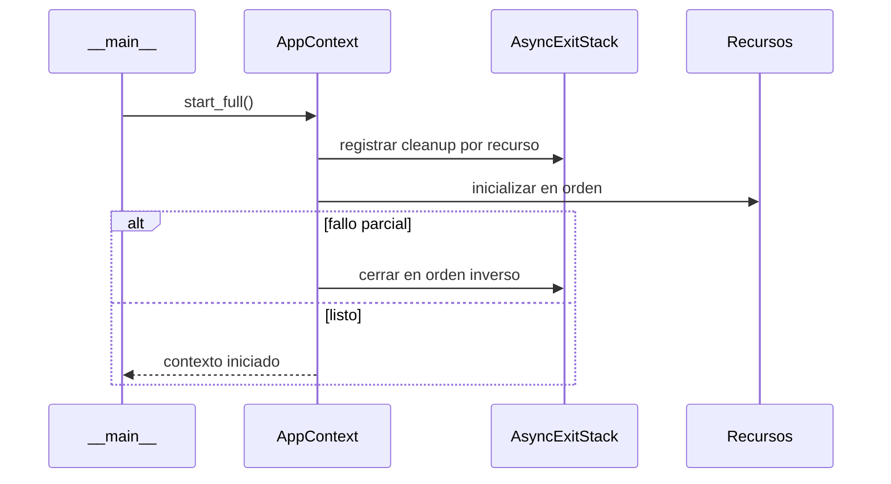

# Ciclo de vida de runtime

> **Estado:** implementado.
>
> **Audiencia:** desarrolladores y operadores.
>
> **Fuentes:** `sky_claw/__main__.py` y `sky_claw/app_context.py`.
>
> **Última verificación:** 2026-07-25 sobre `origin/main` `c6ab35e`.

## Arranque

1. `__main__._parse_args()` resuelve modo y flags.
2. `_main()` deriva instalación del bridge o health-check cuando corresponde.
3. `AppContext.start_full()` serializa la inicialización con su lock.
4. `AsyncExitStack` registra compensaciones a medida que cada recurso arranca.
5. Se construyen red, DB lifecycle, servicios locales, tools y router.
6. El modo elegido toma el control de la interacción.

Existe también `start_minimal()` para contextos reducidos. El helper de módulo
`start_full(args)` construye y devuelve un `AppContext`.

## Cierre

`AppContext.stop()` es idempotente y coordina cleanups del generation stack.
Cancela las tareas en background y espera su drenaje como máximo
`_startup_shutdown_timeout_s`. Si alguna sigue pendiente, ejecuta igualmente
`_close_cleanup_generation()` con un timeout acotado y después propaga el
`TimeoutError` de las tareas; por tanto, el drenaje completo no es una garantía.
El orden importa: el cierre intenta detener trabajo en background y dependientes
antes de cerrar journal, locks, DB y sesiones de red.

Los modos no GUI instalan el handler de excepciones del loop desde `__main__`.
NiceGUI/uvicorn administra su propio loop y logging; no se debe extrapolar el
handler de CLI al modo GUI.

## Cancelación

La cancelación no equivale a éxito ni a cierre completo. Los componentes que
protegen estado usan cleanup en `finally`, tasks con referencia fuerte o
`shield` cuando deben alcanzar un resultado terminal. El detalle de cada
subsistema vive en [async_concurrency.md](async_concurrency.md).
