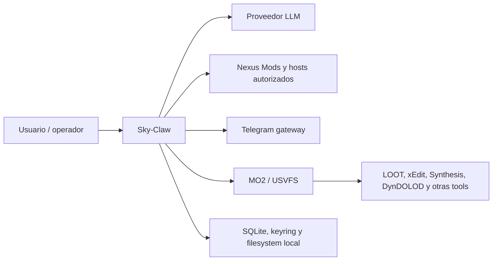

# Contexto del sistema

> **Estado:** implementado con integraciones externas dependientes del entorno.
>
> **Audiencia:** desarrolladores, operadores y agentes.
>
> **Fuentes:** `__main__.py`, `app_context.py`, `app/` y `local/`.
>
> **Última verificación:** 2026-07-25 sobre `origin/main` `c6ab35e`.

Sky-Claw conserva el control plane y delega la vista virtualizada a MO2. No
implementa las herramientas externas ni garantiza su comportamiento por
haber construido correctamente un wrapper.

## Fronteras

- **Entrada humana:** GUI, CLI, Telegram y web.
- **Entrada estocástica:** respuestas y tool calls del proveedor LLM.
- **Red:** `NetworkGateway` y callers que reciben su instancia.
- **Filesystem:** `PathValidator` con roots configurados por el contexto.
- **Procesos:** runners y broker USVFS.
- **Persistencia:** DB lifecycle, journal, locks, snapshots y config.

Los componentes externos pueden faltar, tener versiones incompatibles o
requerir un perfil real. Esas condiciones pertenecen al preflight y al smoke,
no a la arquitectura aspiracional.
