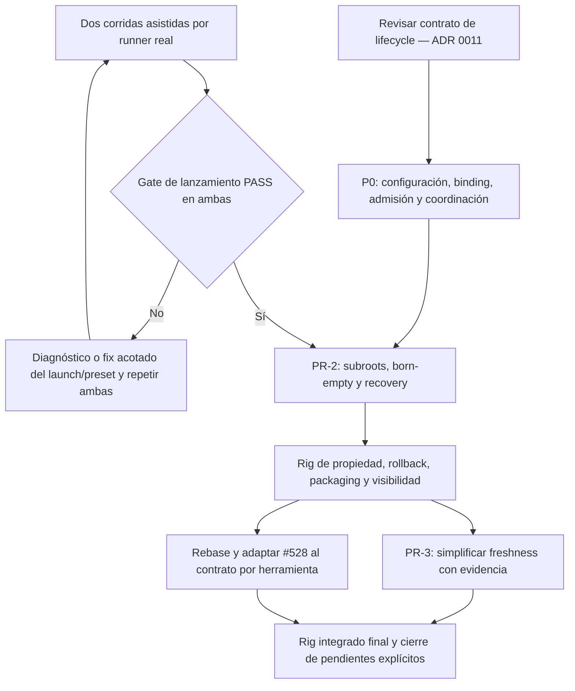

# DynDOLOD PR-2 — plan de resolución y aceptación

> **Para agentes implementadores:** ejecutar por tareas con
> `superpowers:subagent-driven-development` o `superpowers:executing-plans`.
> **Estado:** propuesta documental, sin implementación. **Gate de lanzamiento:
> PASS** (T5-v2, 2026-09-10 — [informe commiteado](../../validation/2026-09-10_t5v2_dyndolod_stage9.md));
> PR-2 pasa a estar bloqueado únicamente por P0.
> **Decisión:** cerrada por [ADR 0011](../../adr/0011-dyndolod-external-work-root.md);
> su detalle normativo vive en la
> [spec del contrato](../specs/2026-09-09-dyndolod-external-work-root.md).

**Objetivo:** habilitar staging externo exclusivo para TexGen y DynDOLOD con
recuperación verificable y sin perder los contratos de #552/#567.

**Arquitectura:** preferencia persistente por instancia (`external_work_root`),
identidad `binding_id` + evidencia `resource_binding`, derivación única en
`output_targets`, dos destinos born-empty y coordinación/recovery con identidad
estable.

**Stack:** Python, Config TOML, pathlib, asyncio, SQLite/gestor de locks existente,
DirectoryRollback, pytest; Windows y binarios reales para aceptación.

## 1. Baseline y correcciones a los informes

- `origin/main`: `5e5e9448db0d4015b3bf0dc4c1df10fdc49e226c` (#569), fetch
  2026-09-09. (El baseline del primer draft, `5966c23c`, quedó desactualizado
  por el merge de #569.)
- [#528](https://github.com/FacundoSu1986/Sky-Claw/pull/528): OPEN, DRAFT,
  HEAD `7e359ced5a0fb0adc97a4a74b27339d4a2f15736` re-verificado el 2026-09-09.
  Los worktrees locales de ese PR están atrasados; no usarlos como HEAD remoto.
- El segundo adjunto del usuario, encabezado «Informe técnico — feat(dyndolod)…»,
  aporta el análisis principal; el tercer adjunto aporta IDs AAA T-PR2-01…15.
  Sus referencias ordinales a «primer/segundo informe» no se usan como identidad.
- Verificación previa en la worktree documental (sobre `5966c23c`): `pytest`
  sobre `test_output_targets.py`, `test_rollback_reconciler.py`,
  `test_estado_ooda.py`: **60 passed, 2 skipped** (guards de symlink Windows),
  una advertencia de deprecación de dependencia. No se ejecutó la suite completa
  ni un rig nuevo.
- El builder ya permite inyectar `DynDOLODConfig(output_root=...)`. Se puede
  probar cada launcher real con una raíz de rig sin implementar PR-2.
- `DirectoryRollback` no crea el root vacío. El reconciliador conserva backup y
  target cuando ambos existen; no tiene una purga DynDOLOD de 24 horas.
- No existe actualmente un handler DynDOLOD en `AsyncToolRegistry`. Enumerar las
  superficies existentes y detectar una futura incorporación; no inventar una.
- `exito_no_empaquetable` para ZIP figura en el roadmap, pero no se encontró
  implementado en el runner actual. Es pendiente separado del gate de lanzamiento.
- **Primitivas existentes que PR-2 reutiliza (verificadas por lectura):**
  detección/borrado link-aware (`sky_claw/app/security/links.py`,
  `is_link`/`link_kind`/`rmtree_link_aware`, anclada por `tests/test_links.py`),
  `PathValidator.validate` con `strict_symlink`, escritura atómica
  temporal + `os.replace` (patrón de `Config.save()` y `local_config.py`;
  `os.replace` sirve para actualizar un archivo propio, NO para la creación
  single-winner del binding — para eso el árbol aún no tiene primitiva adecuada
  y P0.1 la construye), maquinaria de locks distribuidos cross-process
  (`test_distributed_locks.py`), `escribir_campo`/`guardar_config`/
  `persistir_campo` con merge-on-save.
  El mecanismo de Known Folders **no existe** en el árbol: es construcción de P0.

### Evidencia externa localizada y revisada

| Artefacto local | Qué demuestra | Qué no demuestra |
|---|---|---|
| `C:\Modding\DynDOLOD RigTest\_rig_test\evidence\INFORME_T5_ARGV_DYNDOLOD_ALPHA209.md` | Quoting observado y desvío TexGen con preset; corridas positivas posteriores sin preset | Gate endurecido con ambos presets y runner actual |
| `C:\Modding\DynDOLOD RigTest\_rig_test\evidence\t5a_20260830\INFORME_T5A_REAL_RIG_20260829.md` | 1362 archivos TexGen en destino del preset, cero en su `-o:`; DynDOLOD generado sin preset | PASS de T5-v2; TexGen no tiene rc capturado y los lanzamientos fueron directos |
| [`docs/validation/2026-09-10_t5v2_dyndolod_stage9.md`](../../validation/2026-09-10_t5v2_dyndolod_stage9.md) — **commiteado en el repo** (raw externo: `E:\Sky-Claw T5 Rig\evidence\2026-09-10_1640\`, huellado en el informe) | **Gate de lanzamiento PASS**: dos corridas separadas por el runner, roots con espacios, eco `Using Output Path:` exacto, outputs físicos en el root, presets rancios ejercitados (TexGen auto-carga; DynDOLOD aplica en Advanced) con corrección asistida, cero desvío, restauración verificada | Criterios 8–10 del checklist (ZIP, dos mods disjuntos, visibilidad billboards) y el rig de servicio completo post-PR-2 |
| `...\t5a_20260830\manifests\session_manifest.json` y `output_manifest_sha256.csv` | Inventario fechado para contrastar resultados | Estado actual de presets o inputs |
| `E:\Skyclaw_Main_Sync\dyndolod\_rig_test\rig_harness.py` | Harness histórico con argv anterior a #462 | Aceptación del launcher de producción; `--raw` tampoco lo prueba |

Los informes históricos (2026-08-10, 2026-08-11 y T5a/2026-08-29) siguen **fuera
del repo**, aunque se encontraron en esta máquina; el informe T5-v2 2026-09-10 de
la fila anterior está **commiteado**. La etiqueta histórica PASS de T5a no
cerraba el gate entonces. En T5a, «presets intactos»
no equivale a integridad byte a byte: el propio informe registra una reescritura
por Start. El rig T5-v2 capturó y restauró el estado real del día con hashes
before/after.

## 2. Orden de entrega y condiciones de avance



Los dos carriles iniciales pueden prepararse en paralelo. Cada cambio tiene rama
y PR propios. P0 no cambia el `-o:` productivo. Las dos corridas exigidas por
`sky_claw/local/AGENTS.md` §2.9 se ejecutaron y el gate quedó **PASS**
(2026-09-10 — informe commiteado arriba): PR-2 deja de estar bloqueado por T5 y
pasa a estar bloqueado únicamente por P0. La secuencia vigente es ADR 0011 ✅ →
T5-v2 ✅ → P0 → PR-2 → rig de ownership/packaging → PR-3 → adaptar #528.

**No hay dependencia circular:** el gate inicial usa la inyección del runner
actual y prueba lanzamiento/archivos/preset — **ejecutado y PASS el 2026-09-10**
(informe commiteado). El rig posterior prueba el servicio completo con el nuevo
layout y packaging: los criterios 8–10 del checklist T5-v2 siguen siendo SU barra
de aceptación. El gate de lanzamiento quedó cerrado y no se reabre salvo cambios
que alteren cómo se construye o serializa el argv: el builder compartido
(`_build_xedit_args`), el path de spawn/serialización que lo transporta
(`DynDOLODRunner._execute_process` → `create_subprocess_exec`), o los binarios.

## 3. P0 — lifecycle antes de activar la nueva raíz

### P0.1 Preferencia, binding y admisión

**Modificar:** `sky_claw/config.py`, `sky_claw/app/core/path_resolver.py`,
`sky_claw/app_context.py`, `sky_claw/app/orchestrator/supervisor.py` y sus puntos
de composición efectivos. **Crear:** `sky_claw/local/tools/dyndolod_workspace.py`
para admisión, binding y transición; la derivación de outputs sigue en
`output_targets.py`. No convertir el nuevo módulo en un segundo Config.

**Contrato del binding (ADR 0011 §2.2–2.4):** `binding_id` UUID generado una vez
al inicializar el root; `resource_binding` = objeto anidado con la evidencia
canonicalizada (`game_path`, `mo2_instance_data_root`, `mo2_mods_path`);
`config_path` NO pertenece al binding (schema v1 congelado, cerrado; campo
fuera de schema = caso E fail-closed); metadata
`.sky-claw-binding.json` en el root, fuera de los subroots movibles; escritura
atómica con `os.replace` reservada a actualizaciones del binding propio, y
**creación inicial single-winner no-reemplazante** (nunca `os.replace` para
crear: el perdedor no reemplaza el archivo del ganador — lo relee, valida el
`resource_binding` publicado y continúa sólo si es compatible); máquina de
estados A–H de la spec, con rechazo fail-closed en D, E, F, G y H.

**Tests:** `tests/test_local_config_persistencia.py`,
`tests/test_path_resolution_service.py`,
`tests/test_supervisor_path_resolution_wiring.py`,
`tests/test_mo2_controller_split_roots.py`, nuevo `tests/test_dyndolod_workspace.py`.

- [ ] Escribir casos rojos: campo ausente, persistencia/reinicio/merge concurrente,
  raíz ajena (F), raíz solapada, enlaces, owner distinto y config copiada del
  mismo owner, y **la máquina de estados A–H enumerada caso por caso** (un test
  paramétrico que liste A–H, no una muestra).
- [ ] Single-winner del binding: dos inicializaciones concurrentes del mismo
  root vacío producen exactamente un binding, **con primitiva
  no-reemplazante** (creación exclusiva, lock cross-process alrededor del
  check + publish, o mecanismo equivalente con la propiedad demostrable):
  el perdedor NO reemplaza el archivo del ganador — lo relee, valida el
  `resource_binding` publicado y continúa sólo si es compatible. `os.replace`
  queda reservado a actualizaciones del binding propio, nunca a la creación.
- [ ] Caso H: mismo `resource_binding` ya tiene otro root activo → rechazo con
  transición explícita. La detección es instalacional vía el estado durable de
  coordinación (P0.2); este punto queda anclado con su test cuando ese estado
  exista, y hasta entonces cualquier root con un binding compatible pero sin
  registro de unicidad se trata fail-closed, no como caso C indistinto.
- [ ] Metadata corrupta y schema desconocido → rechazo fail-closed (caso E).
- [ ] Congelar el censo de constructores de resolver, incluido health CLI de
  `__main__.py`: comprobar que la ausencia del campo no rompe ese consumidor.
- [ ] Ejecutar esos tests y comprobar el motivo de fallo antes de implementar.
- [ ] Agregar default vacío, accessor validado y binding atómico versionado.
  Registrar en sandbox solo la familia administrada y metadatos precisos
  necesarios; nunca un ancestro arbitrario ni toda una unidad.
- [ ] Mecanismo de Known Folders prohibidos para la admisión: construirlo con
  su test parametrizado sobre el conjunto cerrado v1 de la ADR §2.7
  (`Documents`, `Desktop`, `Downloads` — cada carpeta justificada en el ADR):
  cada Known Folder contractual, resuelto por identificador con la API de
  Known Folders de Windows (ruta efectiva vigente, incluidas redirecciones a
  otros volúmenes), hace rechazar el `external_work_root`. El caso de prueba
  incluye al menos una carpeta redirigida (p. ej. Documents en otro volumen o
  en OneDrive). Sin búsqueda de substrings, sin derivar desde `%USERPROFILE%`
  (no refleja redirecciones) y sin prometer detección universal de proveedores
  cloud.
- [ ] Declarar el nuevo módulo workspace con typing estricto en `pyproject.toml`,
  como el reconciliador, en vez de heredar la exención general de tools.
- [ ] Probar que todavía se conserva el `-o:` actual: P0 configura capacidad,
  pero no activa PR-2 ni modifica packaging.
- [ ] Ejecutar pruebas verdes; actualizar documentación del contrato real;
  revisar y registrar el cambio en su PR.

### P0.2 Coordinación y transición durable

**Modificar:** `sky_claw/app_context.py`,
`sky_claw/app/orchestrator/rollback_factory.py`,
`sky_claw/app/orchestrator/orchestration_composition.py`,
`sky_claw/app/orchestrator/preview/chain_preview_service.py`,
`sky_claw/local/tools/dyndolod_service.py`,
`sky_claw/local/tools/rollback_reconciler.py` y el módulo workspace anterior.
Si hace falta un accessor de estado runtime estable, añadirlo a `SystemPaths`;
es distinto del work root y no se deriva del cwd ni de una env var de staging.

**Tests:** `tests/test_distributed_locks.py`, `tests/test_dyndolod_workspace.py`,
`tests/test_startup_recovery_order.py`, `tests/test_dir_rollback.py`,
`tests/test_rollback_reconciler.py` y tests de composición.

- [ ] Escribir primero un test con dos procesos/cwd distintos que intentan mutar
  el mismo recurso. El segundo debe bloquear o fallar antes del move-aside.
  Repetir con work roots distintos y ejecutable compartido.
- [ ] Enumerar servicio, preview, recuperación, resume y entrada al runner:
  todos los mutadores productivos deben adquirir la coordinación común. El
  runner público de rig se usa aislado y no promete transacción de servicio.
- [ ] Inyectar un gestor de etapa 9 con DB común bajo estado durable por
  usuario, ubicación independiente de cwd. Mantener `dyndolod-pipeline`, leases
  y renovación; definir un orden de adquisición fijo con locks/journals
  existentes. No migrar los otros rituales incidentalmente.
- [ ] Probar pérdida de lease, cancelación y crash: no liberar coordinación
  mientras procesos o tareas de restauración siguen mutando. Preservar orden de
  recovery de journal, handoff y backups.
- [ ] Persistir referencia a la raíz activa y transición antes del cambio TOML.
  Testear interrupción en cada frontera y edición manual del TOML: no olvidar
  old root ni activar otro si hay backups/PENDING o no puede inspeccionarse.
  Este estado durable de coordinación es también el que hace detectable el
  caso H (unicidad de `external_work_root` activo por `resource_binding`,
  instalacional): registrarlo con clave de `resource_binding` y probar que dos
  roots con el mismo `resource_binding` no pueden quedar ambos activos.
- [ ] Cambio de preferencia = aplicar en próximo arranque (ADR 0011 §2.5), sin
  hot-reload de AppContext/PathValidator/runner cache/reconciler/TX activas.
- [ ] Confirmar verdes y revisión de wiring. P0 es requisito previo, no una
  declaración de soporte multiproceso basada en el nombre de un lock.

## 4. Rig inicial — dos corridas separadas

### Preparar una sesión reproducible

- [ ] Registrar SHA de Sky-Claw, Python, versiones y SHA-256 de ambos binarios,
  Windows, juego, instancia MO2, perfil, INIs, plugins y configuración completa.
- [ ] Verificar los prerrequisitos reales de etapa 9 y el Data que el proceso
  leerá. El rig histórico tiene un junction hacia otro volumen: inspeccionarlo
  y declarar la identidad física; no extrapolar que ve el VFS de MO2.
- [ ] Usar copia aislada del tool y inputs de rig. Preparar raíces nuevas con
  espacios externas a juego/MO2/instalación: `R/TexGen`, `R/DynDOLOD`, más dos
  señuelos `R/Stale TexGen` y `R/Stale DynDOLOD`. `R` es una selección de rig,
  no un default de producto. Capturar espacio disponible por volumen.
- [ ] Descubrir el preset efectivamente cargado por **cada versión/binario**.
  El nombre oficial moderno `..._TexGen_Default.ini` difiere del `_TexGen.ini`
  observado en Alpha-209. No endurecer el conductor alrededor de un solo nombre.
- [ ] Copiar y firmar presets/INI originales, registrando también su ausencia.
  Preparar preset válido de cada tool apuntando a su señuelo. No borrar el
  preset rancio antes de lanzar para obtener un verde artificial.
- [ ] Firmar manifiestos de raíces, señuelos, defaults de salida y logs antes.
  Usar instalación de rig nueva o conservar el prefijo de logs para que el
  runner pueda atribuir completion y terminales a esta ejecución.

### Conductor a preparar para la sesión

Crear un conductor local de evidencia que importe `DynDOLODConfig` y
`DynDOLODRunner` desde el checkout fijado; debe validar y registrar la ruta del
módulo importado. No reconstruir argv, no monkeypatch de `_execute_process`, no
Popen paralelo y no usar el harness histórico como launcher.

Configurar explícitamente los campos existentes: `game_path`, `mo2_path`,
`mo2_mods_path`, ejecutables, `data_dir`, `ini_dir`, `plugins_file`, `temp_dir`,
`game_mode` y `output_root`. Usar una configuración y una llamada pública por
herramienta (`run_texgen()` / `run_dyndolod()`). No llamar `run_full_pipeline`
para inferir dos pruebas independientes.

Capturar argv producido por el runner, command line real observada con PID/exe,
horarios, resultado completo y excepciones. El conductor solo agrega captura, no
reemplaza las decisiones de éxito. `E:\t5_alpha209_rig.py` es referencia
histórica: está fijado a un SHA viejo, solo cubre DynDOLOD y contiene supuestos
antiguos de logs/INI; no se ejecuta intacto.

### Aplicar exactamente la misma receta a TexGen y DynDOLOD

- [ ] Confirmar raíz de esa herramienta vacía y preset rancio presente.
- [ ] Lanzar por el método real del runner. Capturar PID/ejecutable y campo
  Output inicial. Demostrar que el preset rancio fue efectivamente cargado; su
  mera presencia en una carpeta no demuestra que el binario lo leyó.
- [ ] Si Output difiere, el operador corrige **solo ese campo en el wizard**
  antes de Start. Capturar antes/después y registrar intervención manual. Si el
  valor ya coincide, registrar la observación y verificar carga del preset.
- [ ] Generar y cerrar conservando archivos sueltos (nombre real del botón
  según versión; no usar ZIP en esta prueba).
- [ ] Exigir `Using Output Path:` exacto, sin normalizar para disimular una
  divergencia, y resultado válido del runner: rc 0, artefacto fresco, completion
  de esta corrida y ausencia de terminales actuales.
- [ ] Comprobar contenido físico: `TexGen/textures/...` para TexGen;
  `DynDOLOD.esp` en un candidato propio para DynDOLOD. Manifestar todos los
  archivos generados con tamaño y SHA-256; no aceptar solo conteos/mtime.
- [ ] Comparar señuelo, raíz hermana y destinos alternativos conocidos: ningún
  artefacto generado debe haberse desviado. Separar logs/INI/scratch esperados
  del contenido de salida. Si no se puede atribuir la escritura, INCONCLUSO.
- [ ] Esperar salida de todo el árbol de procesos; guardar logs completos,
  dumps/capturas y manifiestos antes de restaurar presets/INI originales.
  Verificar hashes tras restauración y ausencia donde originalmente no existía.

**PASS global = PASS TexGen AND PASS DynDOLOD.** Una corrida con eco correcto
pero sin archivos es FAIL. Un aborto seguro por UIA es evidencia negativa, no
PASS positivo. Si falla serialización, corregir únicamente el builder común con
TDD y repetir ambas herramientas. No cambiarla preventivamente: la evidencia
Alpha-209 muestra que toleró la divergencia sintáctica bajo ciertas condiciones.

Si el procedimiento asistido no conserva Output o el requisito cambia a control
automático, abrir un fix acotado de precedencia de presets antes de PR-2. No
mezclar una sanitización no diseñada con el refactor de staging.

### Paquete de evidencia obligatorio

Una carpeta por sesión, dos registros por herramienta y un veredicto global:

```text
session.json                 # SHA, versiones, paths físicos, configuración
TexGen/ y DynDOLOD/
  before/                    # presets, hashes, manifiestos, prefijo log
  argv.json                  # builder + command line/PID observados
  output-before / after      # captura del campo, PID y corrección humana
  result.json                # resultado íntegro del runner
  logs/                      # archivos crudos completos
  outputs.sha256             # manifiesto relativo completo
  decoys-before / after      # prueba de no desvío
  restoration.json           # comparación contra estado inicial
verdict.md                   # PASS/FAIL/INCONCLUSO por criterio y herramienta
```

En el PR documental de evidencia guardar índice, hashes y extractos suficientes
para auditar; no commitear GBs, binarios de terceros ni secretos. Si los archivos
crudos quedan externos, mantener expresamente esa condición y su localización.

## 5. PR-2 — implementación después del gate

### P2.1 Derivación y modelo

**Archivos:** `output_targets.py`, `dyndolod_runner.py`;
**tests:** `test_output_targets.py`, `test_dyndolod_service.py`,
`test_contrato_argumentos_cli.py` (todos bajo sus directorios actuales).

- [ ] Escribir rojo T-PR2-01…03 y anclas de consumidores: un builder por tool,
  raíces hermanas exclusivas, familia jamás empaquetable y aliases rechazados.
- [ ] Añadir en `output_targets.py` derivación pura desde raíz admitida;
  representar `family_root`, `texgen_root`, `dyndolod_root` explícitamente
  (layout §7 de la spec; los strings se congelan como constantes).
- [ ] Migrar cada uso de `output_root`; actualizar la interfaz pública de forma
  explícita y sus fixtures, sin alias que siga apuntando al viejo juego.
- [ ] Mantener `_build_xedit_args` compartido, seleccionando el `-o:` por tool,
  y adaptar anclas AST al nuevo selector sin rebajar protección de extra_args.
- [ ] Verde: ambas ramas de launcher y constructor de argv, incluyendo espacios.

### P2.2 Servicio, transacción y packaging

**Archivos:** `dyndolod_service.py`, `dyndolod_runner.py`,
`orchestration_composition.py`, `preview/chain_preview_service.py` si el nuevo
contrato necesita inyección. **Tests:** `test_dyndolod_service.py`,
`test_dyndolod_handoff_durable.py`, `test_active_indeterminate_evidence.py`,
`test_carrera_intercalada_post_release.py`.

- [ ] Escribir rojo T-PR2-04…05,07…13. Casos por tool y `create_snapshot`
  True/False; `run_texgen=False` conserva staging TexGen sin tocarlo.
- [ ] Reemplazar rollback crudo `root/textures` por roots completos activos.
  Tras entrar en DirectoryRollback, crear y comprobar vacío antes de spawn.
  Mantener backups hasta que cierre la transacción, incluido fallo de DynDOLOD.
- [ ] Usar la misma configuración congelada en permisos, spawn, candidatos,
  manifest, packaging y recovery. El permiso sube solo hasta la frontera
  admitida (root + derivados; jamás la unidad o un ancestro amplio).
- [ ] Preservar prefix `textures`, permitir root directo exclusivo DynDOLOD,
  rechazar familia/hermana/escape. Adaptar firmas a candidatos nuevos sin borrar
  freshness ni taxonomía. Medir tamaño antes de copia y manejar ENOSPC.
- [ ] Mutaciones link-aware: reutilizar `sky_claw/app/security/links.py`
  (`rmtree_link_aware`) y revalidar identidad al mutar; ninguna mutación
  administrada resuelve fuera del root admitido por un componente redirigido.
- [ ] Verde: cuatro prerrequisitos #567, flags, F1, ambos resumes, cancelación,
  copia fallida entre unidades y ausencia de contaminación.

### P2.3 Recovery, migración y documentos

**Archivos:** `rollback_reconciler.py`, `app_context.py`, workspace P0.
**Tests:** `test_rollback_reconciler.py`, `test_startup_recovery_order.py`,
`test_orphan_evidence_producer_contract.py`, `test_dir_rollback.py`.

- [ ] Rojo: igualdad exacta de dos roots crudos + dos mods, con la familia de
  targets separada por rol: los `ACTIVE_TARGET` (subroots del
  `external_work_root`) como únicos destinos mutables de los productores
  nuevos, y el `LEGACY_RECOVERY_ONLY_TARGET`
  (`<game>/Sky-Claw/DynDOLOD/textures`) sólo en la superficie de recovery;
  detectar productores nuevos por introspección/AST.
- [ ] Recuperación legacy separada de la familia mutante, congelando el
  **predicado cerrado de ADR §2.9 / spec §8** (el que `rollback_reconciler` ya
  aplica a un destino move-aside), no un happy-path suelto. `T-PR2-23` enumera la
  familia completa sobre el único `LEGACY_RECOVERY_ONLY_TARGET`
  `<game>/Sky-Claw/DynDOLOD/textures`; cada caso ejerce el boundary real de
  `reconcile_orphan_rollback_backups` y afirma disco, no dos helpers:
  - **A. backup legacy válido + target ausente** (bajo lock seguro) → RESTORE al
    target exacto vía `rename` O(1); target queda con el estado previo.
  - **B. backup legacy válido + target presente** → PRESERVE BOTH; ni el backup
    ni el target se tocan; intervención manual.
  - **C. sibling no relacionado** (sufijo válido, basename ≠ `textures`) →
    IGNORE; ni se restaura ni se borra.
  - **D. sufijo `.rollback-*` inválido** (corto, no numérico, no anclado) →
    IGNORE (piso `\d{12,}`).
  - **E. entrada link/junction/reparse** con nombre de backup → IGNORE; nunca se
    restaura como directorio administrado siguiendo el enlace.
  - **F. lock del productor `dyndolod-pipeline` vivo** (aun en otra instancia) →
    SKIP sin mutación; se reporta como omitido.
  - **G. ausencia de backup válido** → NO-OP.
  - **H. target ausente pero el `rename` de restauración falla (`OSError`)** →
    preservar el backup y avisar; nunca se pierde la única copia. Más:
    **idempotencia** — una segunda pasada sobre lo ya restaurado es NO-OP.
  Test explícito adicional: **legacy recovery puede restaurar un backup
  histórico, pero ninguna corrida nueva usa, mueve ni adopta el legacy** — ni
  migrarlo, borrarlo, adoptarlo como staging, pasarlo como `-o:` ni crear
  `DirectoryRollback` nuevos sobre él.
- [ ] Inyectar raíces desde el mismo layout/registro que el service. No mover
  ni borrar la familia histórica completa: el root legacy
  `<game>/Sky-Claw/DynDOLOD` queda intacto salvo la restauración conservadora
  de recovery descrita arriba.
- [ ] Probar crash tras cada move-aside, tras mkdir y tras copia parcial; cubrir
  todos los targets y conservar ambigüedad cuando existen backup y destino.
- [ ] Verde: startup no consume evidencia antes del handoff; edición de config
  no hace perder referencias a backups viejos.
- [ ] Actualizar `sky_claw/local/AGENTS.md` §2.9, filas precisas de
  `docs/pending_ooda_status.md`, T3 del roadmap y anclas `test_estado_ooda.py`
  en el mismo PR. Mantener rig/preset/ZIP pendientes donde corresponda.

## 6. Matriz AAA mínima, con cierre enumerativo

Cada test comienza con fixture distinguible, ejecuta el boundary real pertinente
y afirma comportamiento/bytes. No basta comparar dos helpers que comparten error.

| ID | Arrange → Act → Assert |
|---|---|
| T-PR2-01 | Config con espacios → ambos launchers → `-o:` reales distintos y correctos |
| T-PR2-02 | Root admitido → resolver layout → padres e identidades exactas |
| T-PR2-03 | Salida hermana/familia/alias → sondeo y packaging → rechazo |
| T-PR2-04 | Residuos de ambas tools → setup → vacío en boundary previo a spawn |
| T-PR2-05 | Bytes previos → fallo/cancelación en cada etapa → restauración exacta |
| T-PR2-06 | Backups por cada target → crash/restart → restaurar o conservar según ambigüedad |
| T-PR2-07 | Textura distinguible TexGen → packaging → prefijo `textures` intacto |
| T-PR2-08 | Marcadores distintos en roots hermanos → packaging → ninguna contaminación |
| T-PR2-09 | DynDOLOD.esp directo en root exclusivo → postcheck/package → permitido |
| T-PR2-10 | Cada switch/modo protegido × launcher → extra_args → rechazo antes de spawn |
| T-PR2-11 | Cada prerrequisito #567 ausente → pipeline → cero spawn DynDOLOD |
| T-PR2-12 | Cada corte #567/F1 → resultado → flags exactos y None si no hubo spawn |
| T-PR2-13 | Resume con/sin mod preservado → ejecutar → contratos vigentes y TexGen crudo intacto |
| T-PR2-14 | Detectar callers/productores en AST → igualdad literal → ninguna superficie omitida |
| T-PR2-15 | Logs actuales/heredados/terminales → suite taxonomía → reglas intactas |
| T-PR2-16 | Campo nuevo + dos Config → saves intercalados/reinicio → preferencia y otros campos íntegros |
| T-PR2-17 | Overlap/enlaces/raíz amplia → admisión sandbox → rechazo sin mutar |
| T-PR2-18 | Cwd distintos, mismos recursos → dos procesos → exclusión real hasta recovery |
| T-PR2-19 | Cambio root + crash/disco ausente → startup → conserva referencia vieja y bloquea activación |
| T-PR2-20 | Volúmenes compartidos/distintos + fallo de copia/ENOSPC → rollback → backups íntegros |
| T-PR2-21 | Estados de root A–H enumerados → inicializar/utilizar/rechazar según la tabla de la spec (H incluye doble activación del mismo `resource_binding`) |
| T-PR2-22 | Dos procesos reales (o mecanismo equivalente cross-process, no sólo coroutines) inicializan el mismo root vacío → exactamente un binding publicado con primitiva no-reemplazante; el perdedor NO reemplaza el archivo del ganador: lo relee, valida el `resource_binding` y continúa sólo si es compatible; metadata corrupta → fail-closed |
| T-PR2-23 | Familia enumerada A–H del predicado cerrado de recovery legacy (ADR §2.9 / spec §8) sobre el único `LEGACY_RECOVERY_ONLY_TARGET` `<game>/Sky-Claw/DynDOLOD/textures`, vía `reconcile_orphan_rollback_backups`: **A** válido + target ausente → restaura; **B** válido + target presente → preserva ambos; **C** sibling con basename ≠ `textures` → ignora; **D** sufijo inválido (`< 12` dígitos / no numérico) → ignora; **E** enlace/junction con nombre de backup → nunca restaura siguiendo el enlace; **F** lock `dyndolod-pipeline` vivo → skip sin mutar; **G** sin backup válido → no-op; **H** target ausente + `rename` falla (`OSError`) → preserva el backup, e idempotencia en segunda pasada. Además: ningún productor nuevo declara el legacy —ninguna corrida nueva lo usa, mueve, adopta, pasa como `-o:` ni crea `DirectoryRollback` sobre él |

T-PR2-14 enumera **familias**, no solo dos casos conocidos: consumidores de
layout, emisores `-o:`, lanzadores, productores de move-aside y superficies de
composición. Reutilizar los anclas existentes de familias de outputs, producers,
runner correlacionado y constructores de resolver. Agregar un tercero debe romper
el test hasta registrar su receta de comportamiento. T-PR2-21/22/23 anclan la
máquina de estados, el single-winner del binding y la frontera del legacy
**enumerando**, en el estilo de
`test_ritual_dispatch.py` y `test_db_connection_invariant.py`. T-PR2-22 exige
la propiedad entre **procesos** del SO: dos coroutines en un mismo proceso
comparten locks y no demuestran cross-process.

## 7. Verificación y cierre

En cada tarea: escribir rojo, comprobar que falla por la propiedad nueva,
implementar mínimo, correr verde y revisar diff. Tests y comentarios en español.
La lista exacta de tests se amplía según archivos tocados; gates finales:

```powershell
.venv/Scripts/python -m pytest tests/test_output_targets.py tests/test_dyndolod_service.py tests/test_dyndolod_taxonomia_log.py tests/test_dyndolod_handoff_durable.py tests/test_rollback_reconciler.py tests/test_startup_recovery_order.py tests/test_estado_ooda.py -q
.venv/Scripts/python -m ruff check sky_claw/ tests/
.venv/Scripts/python -m ruff format --check sky_claw/ tests/
.venv/Scripts/python -m mypy sky_claw/
.venv/Scripts/python -m pytest
```

Preparar venv con `uv sync --extra dev` cuando haga falta. El patrón
`sky_claw.local.tools.*` y varios `app.*` tienen exenciones de mypy; runner y
service quedan cubiertos por esa exención, mientras reconciliador y preflight
UIA poseen overrides estrictos. Revisar el override efectivo por archivo: un
verde global no certifica los tipos de módulos exentos. Verificar contratos
runtime, DI y ramas afectadas.

Después de PR-2, ejecutar servicio completo en rig y demostrar roots born-empty,
restauración en fallo, dos mods con procedencia separada, handoff y visibilidad
de billboards en el Data que DynDOLOD declara. Esos son los criterios adicionales
7, 9 y 10 de T5-v2. Una copia a mods no prueba activación MO2.

Rebasar/adaptar #528 al root esperado **por herramienta** y probar MATCH,
MISMATCH y lectura indeterminada. Su aborto ante MISMATCH debe tener una vía
asistida clara de corregir/reintentar; no declarar que arregla el preset.

PR-3 solo puede retirar mecanismos de freshness cuando haya evidencia de que la
propiedad que protegían queda cubierta en todas las ramas. ZIP tiene su
entrega/aceptación propia (criterio 8); mientras falte, T5 completo sigue parcial.

**Definición de cierre de PR-2:** contrato admitido y persistente, P0 verificado,
gate inicial con ambas tools, implementación revisada, tests apropiados verdes,
rig posterior PASS, OODA/SOP sincronizados y residuos legacy inventariados.
«Plan listo», «pytest verde», «UIA MATCH» o «TexGen generó» no son ese cierre.
